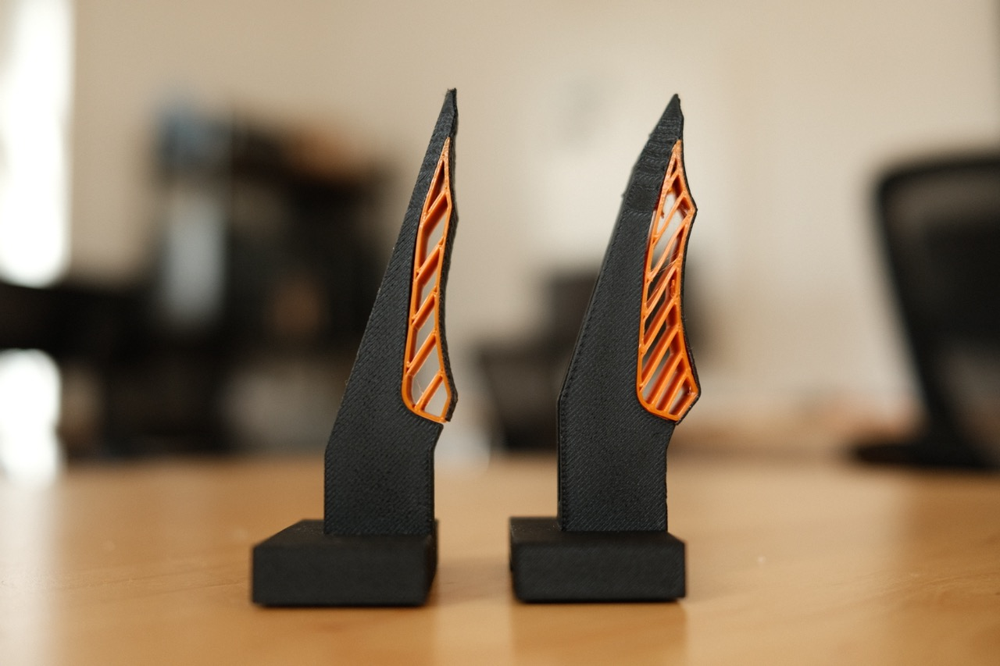
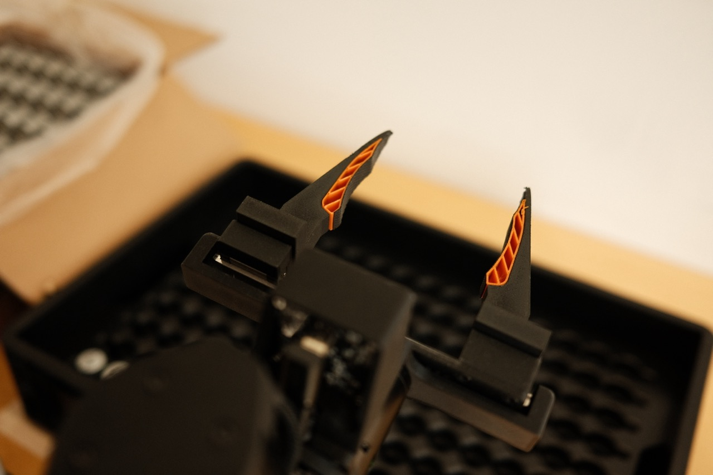
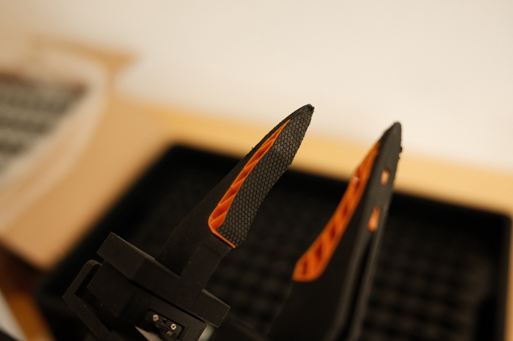
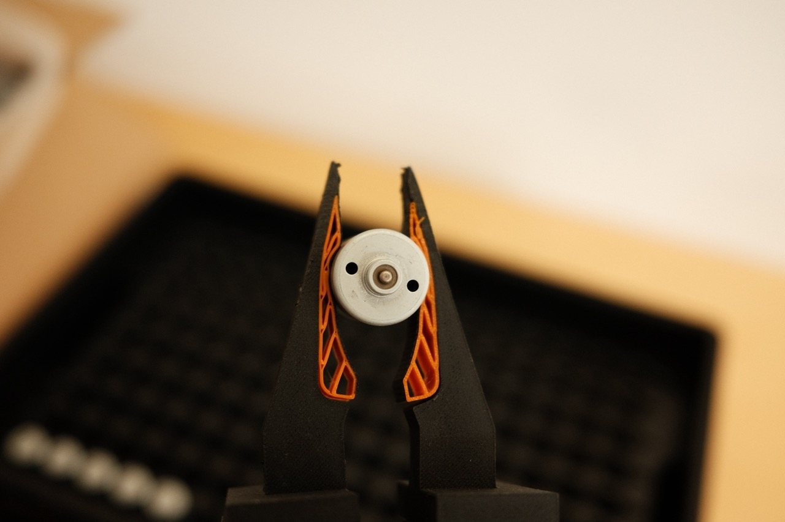
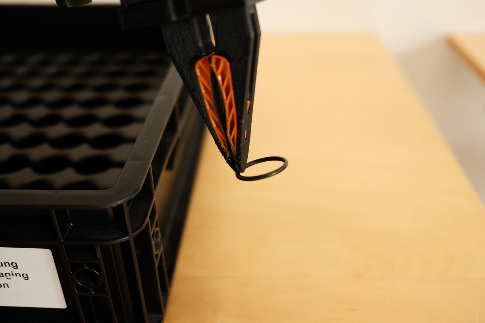

# Dream Gripper

  

The Dream Gripper is a 3D-printable, open-source gripper for the DK1 arm from
The Robot Learning Company. It is designed to pick up small objects such as
O-rings while still holding larger objects such as mugs, using only standard
3D-printing materials and grip tape. A single gripper uses less than EUR 1 of
printed material.

## Highlights

- 3D-printable rigid backbone with a soft TPU insert.
- Slim rigid tips for precise contact on small objects.
- Larger compliant contact area for bigger or sharper objects.
- Strong enough for heavy everyday objects while staying easy to reproduce.
- Visible deflection that can help robot learning policies infer grip force.
- Designed around a linear-rail platform.
- Source model and printable STL files included.

## Files

| File | Purpose |
|---|---|
| [Dream Gripper TRLC.f3d](3D-Files/Dream%20Gripper%20TRLC.f3d) | Fusion 360 source model |
| [PLA-CF Backbone.stl](3D-Files/PLA-CF%20Backbone.stl) | Rigid printed backbone |
| [TPU Insert.stl](3D-Files/TPU%20Insert.stl) | Soft printed insert |

## Variants

The design currently has two variations:

1. **Regular** - the original gripper design.
2. **Jumbo** - a modified version with reduced backbone bending and more inside
   grip. This helps with wide, flat objects such as PCBs and tasks that need a
   stronger grip on a small surface, such as pulling open a zip bag.

## Gallery

<table>
  <tr>
    <td width="50%">
      
    </td>
    <td width="50%">
      
    </td>
  </tr>
  <tr>
    <td width="50%">
      
    </td>
    <td width="50%">
      
    </td>
  </tr>
</table>

## Materials

| Component | Material | Example |
|---|---|---|
| Rigid backbone | PLA-CF | [Bambu Lab PLA-CF](https://eu.store.bambulab.com/products/pla-cf) |
| Soft insert | TPU95A | [TPU95A filament](https://www.amazon.de/dp/B09KKZLZVR?ref=ppx_yo2ov_dt_b_fed_asin_title) |
| Contact surface | Grip tape | [Grip tape](https://www.amazon.de/dp/B0FB8LQ29P?ref=ppx_yo2ov_dt_b_fed_asin_title&th=1) |

## Design Notes

### Gripper Tip

The tip is rigid PLA-CF covered with a thin layer of grip tape. This
**fingernail design** lets the gripper exert more force on small objects while
keeping a slim profile.

### TPU Insert

The middle section uses a soft TPU insert that grips larger objects more firmly
by increasing the contact surface. Objects with sharp corners benefit too: the
TPU wraps the grip tape layer around the edges of the object.

## Assembly

1. Print the backbone in **PLA-CF** and the insert in **TPU95A**.
2. Remove all supports from both parts.
3. Press the TPU insert into the backbone slots. A tight fit is intended.
4. Lay the assembly gripping-side down on a strip of grip tape.
5. Trace the outline onto the back of the tape and cut out the shape.
6. Leave extra tape toward the inside of the gripper so the tape can extend over
   the TPU by a few centimeters on each side. This helps prevent loosening over
   time.

## Credits

Built by **Sixtus Klein** at **[Dream Machines](https://dream-machines.eu/)**.

[LinkedIn](https://www.linkedin.com/in/sixtus-klein-a41421265/?skipRedirect=true) ·
[X](https://x.com/sixtusklein)
